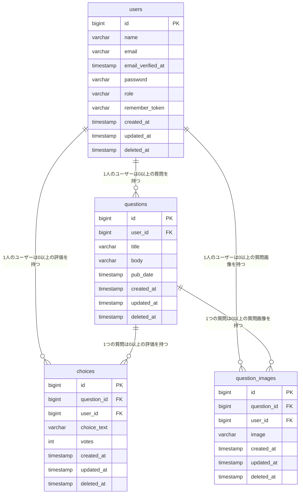

```mermaid

erDiagram
    users ||--o{ questions : "1人のユーザーは0以上の質問を持つ"
    users ||--o{ choices : "1人のユーザーは0以上の評価を持つ"
    users ||--o{ question_images : "1人のユーザーは0以上の質問画像を持つ"

    questions ||--o{ choices : "1つの質問は0以上の評価を持つ"
    questions ||--o{ question_images : "1つの質問は0以上の質問画像を持つ"

    users {
        bigint id PK
        varchar name
        varchar email
        timestamp email_verified_at
        varchar password
        varchar role
        varchar remember_token
        timestamp created_at
        timestamp updated_at
        timestamp deleted_at
    }

    questions {
        bigint id PK
        bigint user_id FK
        varchar title
        varchar body
        timestamp pub_date
        timestamp created_at
        timestamp updated_at
        timestamp deleted_at
    }

    choices {
        bigint id PK
        bigint question_id FK
        bigint user_id FK
        varchar choice_text
        int votes
        timestamp created_at
        timestamp updated_at
        timestamp deleted_at
    }

    question_images {
        bigint id PK
        bigint question_id FK
        bigint user_id FK
        varchar image
        timestamp created_at
        timestamp updated_at
        timestamp deleted_at
    }

```