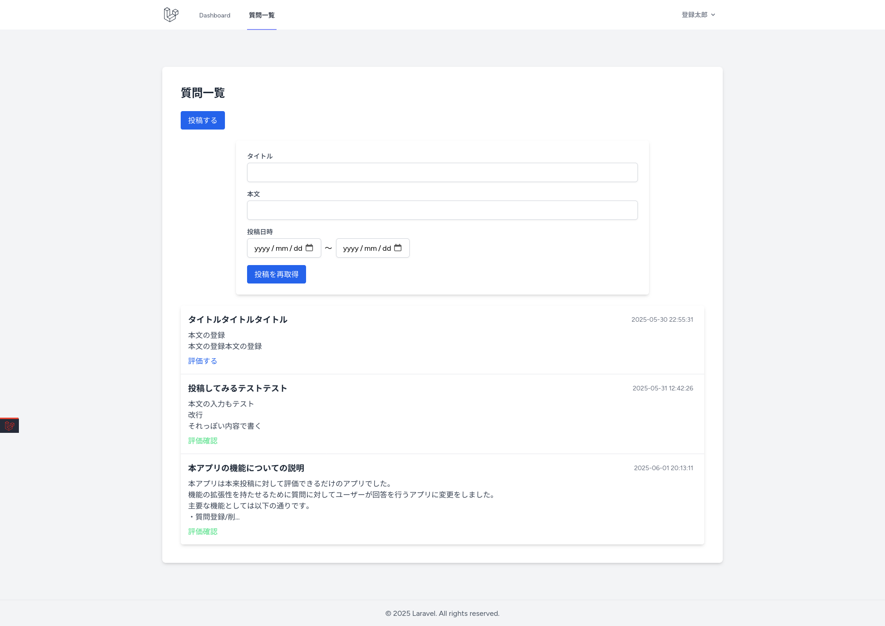
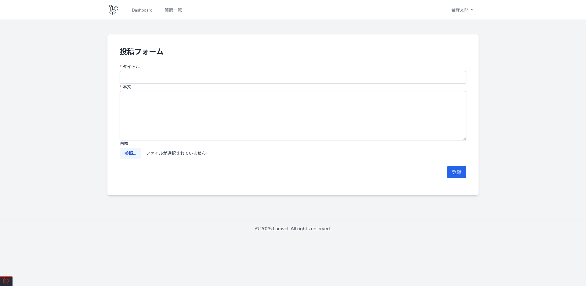
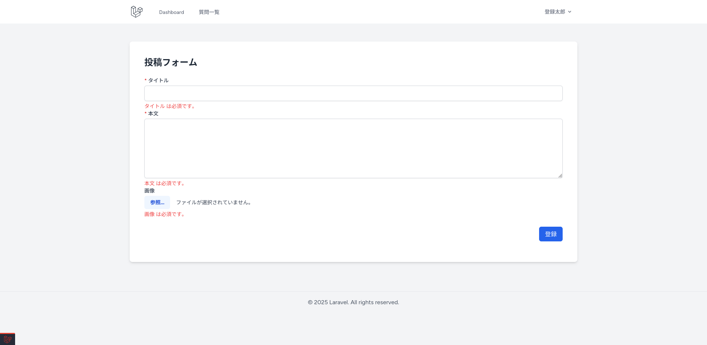
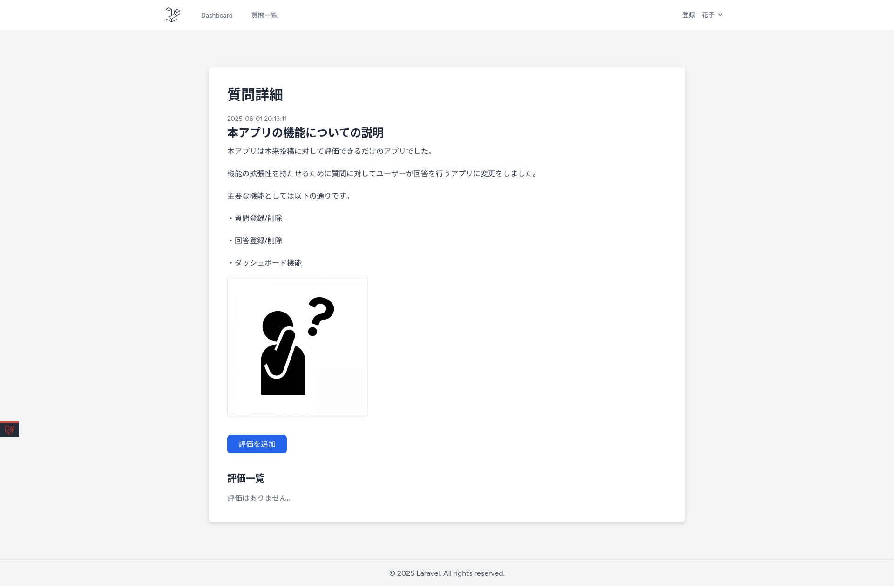
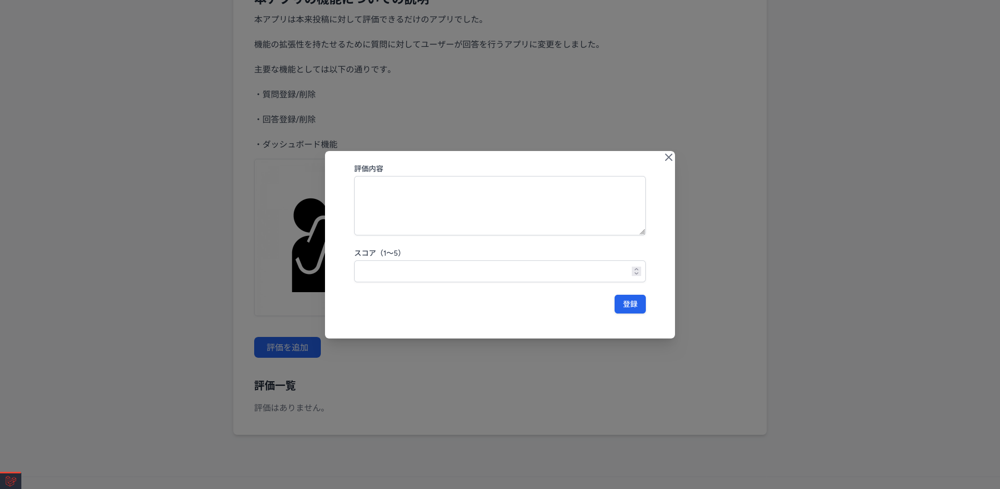
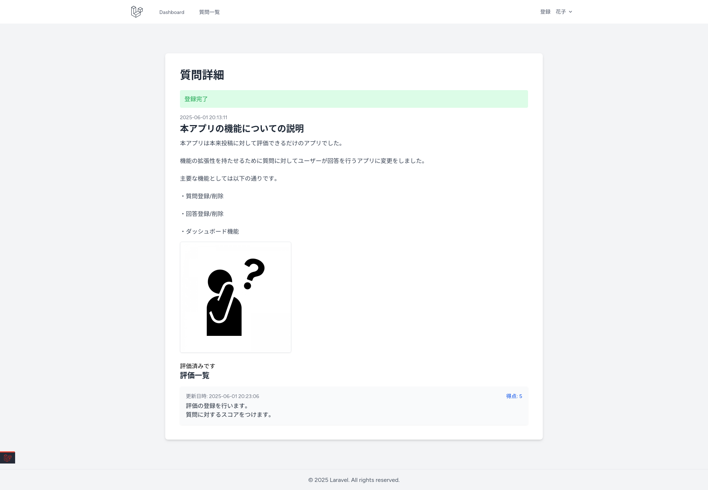
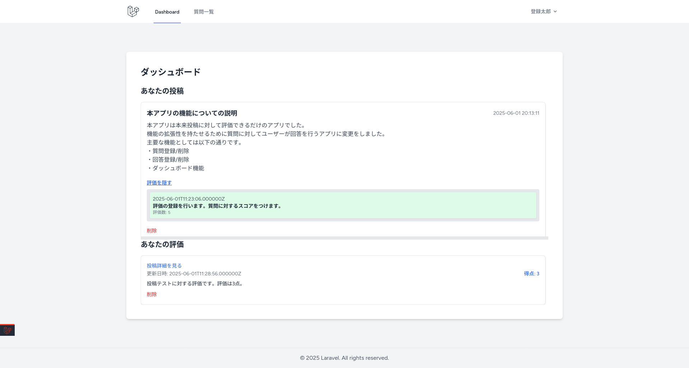
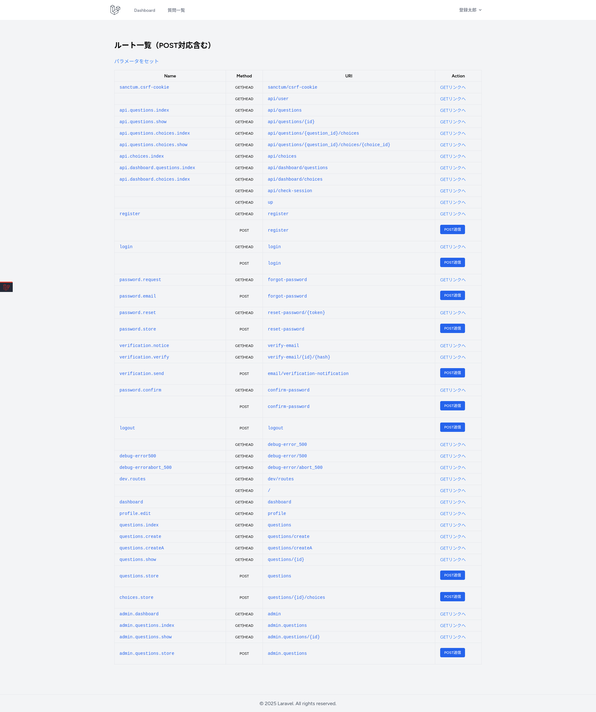

# Laravel × Vue Quiz App（ポートフォリオ紹介）

## 概要

このアプリは、Laravel 11 + Vue 3 + Tailwind CSS によるSPA構成の質問投稿／回答（評価）アプリです。  
ユーザーは質問を投稿し、他のユーザーによる回答を行うことができます。  
今後の機能拡張として、回答後の集計結果(バッチ)やランキング表示も対応予定です。

## 主な機能

- ユーザーによる質問投稿（画像付き）
- 質問への回答・結果の表示
- 質問の検索・一覧表示（Vueによるフィルタ）
- 質問・選択肢・画像の削除
- Laravel Breezeによる認証機能
- APIによるフロント・バックエンド分離

## 画面キャプチャ

### 質問一覧（検索フォーム + 表示）

キャプチャを表示

### 質問投稿フォーム

キャプチャを表示

### 質問詳細(モーダルでの評価)

キャプチャを表示

### ダッシュボード

キャプチャを表示

### 開発用URL一覧

キャプチャを表示

## 使用技術

- Laravel 11（API & サービス構造）
- Vue 3（Composition API）
- Tailwind CSS（レスポンシブデザイン）
- Docker（nginx + php + mysql）
- Vite（フロントビルド）
- GitHub

## 設計・工夫ポイント

- 削除処理時に `boot()` でリレーションを自動削除（Question→Choice/QuestionImage）
- トランザクション + 行ロックによる一貫性担保
- Serviceクラスへの責務分離でControllerを薄く保守性の高い構造に
- Laravel 11の新しい例外ハンドリング構文（`Application::withExceptions()`）に対応
- バリデーション・エラーハンドリングも統一化

## 今後の機能追加予定

- 評価の合計、平均点によるランキング機能（定期バッチ）

## セットアップ方法

 [リポジトリのREADME](../README.md) を参照してください。
