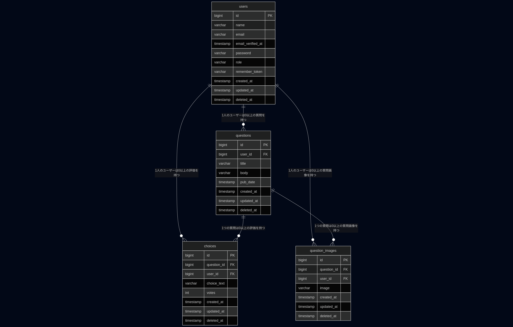
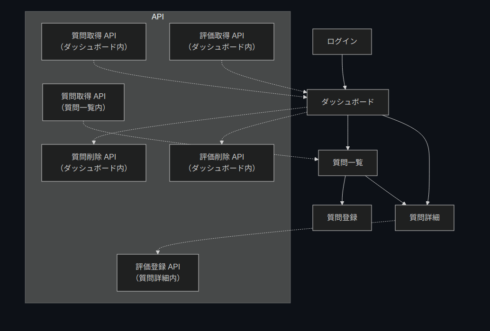
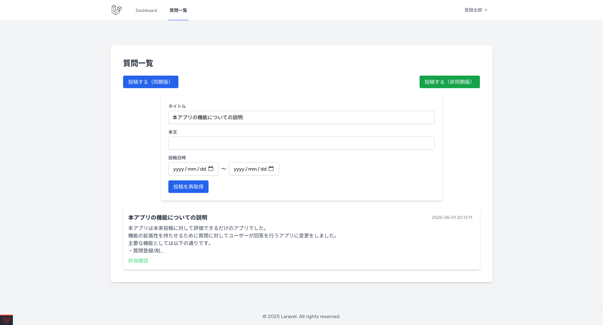
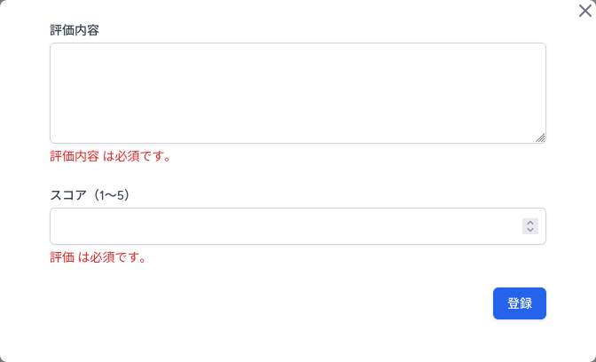

# ポートフォリオ

## 概要

このアプリは、Laravel 11 + Vue 3 + Tailwind CSS によるSPA構成の質問投稿／回答（評価）アプリです。  
ユーザーは質問を投稿し、他のユーザーによる回答を行うことができます。  
今後の機能拡張として、回答後の集計結果(バッチ)やランキング表示も対応予定です。

## 主な機能

- 質問の検索・一覧表示（Vueによるフィルタ）
- ユーザーによる質問投稿（画像付き）
- 質問への回答・結果の表示
- 質問・選択肢・画像の削除
- Laravel Breezeによる認証機能
- APIによるフロント・バックエンド分離

## ER図

キャプチャを表示

自前実装したテーブルのみピックアップ

## 画面遷移図

キャプチャを表示

### 補足

※ 質問削除・評価削除・評価登録はいずれも API 経由で処理され、画面遷移を伴いません。  
　各機能はVueコンポーネント内でAxiosを使って実行し、成功時にUI更新を行っています。

## 画面キャプチャ

### 質問一覧（検索フォーム + 表示）

キャプチャを表示

質問一覧：初期表示

質問一覧：検索時

検索時は非同期で取得の上一覧を再表示(vueコンポーネント)

### 質問投稿フォーム

キャプチャを表示

質問登録：初期表示

質問登録：エラー

登録成功時は質問一覧にリダイレクト処理

### 質問詳細(モーダルでの評価)

キャプチャを表示

質問詳細：初期表示

質問詳細：評価押下時

評価登録モーダルエラー

評価登録モーダル登録後

質問詳細に表示する評価一覧は初期は同期、評価時は非同期で取得の上再表示

### ダッシュボード

キャプチャを表示

ダッシュボード：初期表示

ログインユーザーの質問、評価、質問に紐づく評価の一覧を取得表示する。  
あなたの投稿、あなたの評価は非同期で取得(vueコンポーネント)  
削除押下時、非同期で削除の上、非同期で新規情報を取得の上再表示

### 開発用URL一覧

キャプチャを表示

URL一覧

検証しにくいurlの検証や開発用の画面に即時アクセスできるように作成  

## 使用技術

### バックエンド
- Laravel 11
- Eloquent ORM（リレーション、スコープ）
- Bladeテンプレート
- バリデーション（FormRequest）
- トランザクション制御 / SoftDeletes
- Exceptionカスタマイズ（Laravel 11の`Application::withExceptions()`使用）

### フロントエンド
- Vue 3（Composition API）
- Tailwind CSS
- Vite
- Axios通信
- LocalStorageによる状態保持
- TransitionによるUIアニメーション

### インフラ・その他
- Docker / Docker Compose
- MySQL（8.x系）
- .envによる環境分離

## 今後の機能追加予定

- 評価の合計、平均点によるランキング機能（定期バッチ）

## セットアップ方法

 [リポジトリのREADME](../README.md) を参照してください。
