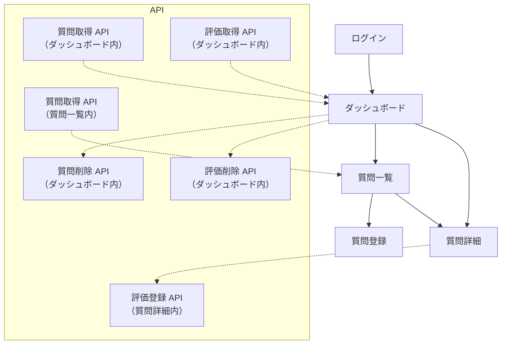

```mermaid

graph TD
    A[ログイン]
    B[ダッシュボード]
    C[質問一覧]
    D[質問登録]
    E[質問詳細]

    A --> B
    B --> C
    B --> E
    C --> D
    C --> E

    subgraph API
        C1[質問取得 API<br>（質問一覧内）]
        C2[評価登録 API<br>（質問詳細内）]
        C3[質問削除 API<br>（ダッシュボード内）]
        C4[評価削除 API<br>（ダッシュボード内）]
        C5[質問取得 API<br>（ダッシュボード内）]
        C6[評価取得 API<br>（ダッシュボード内）]
    end

    C1 -.-> C
    E -.-> C2
    B -.-> C3
    B -.-> C4
    C5 -.-> B
    C6 -.-> B


```